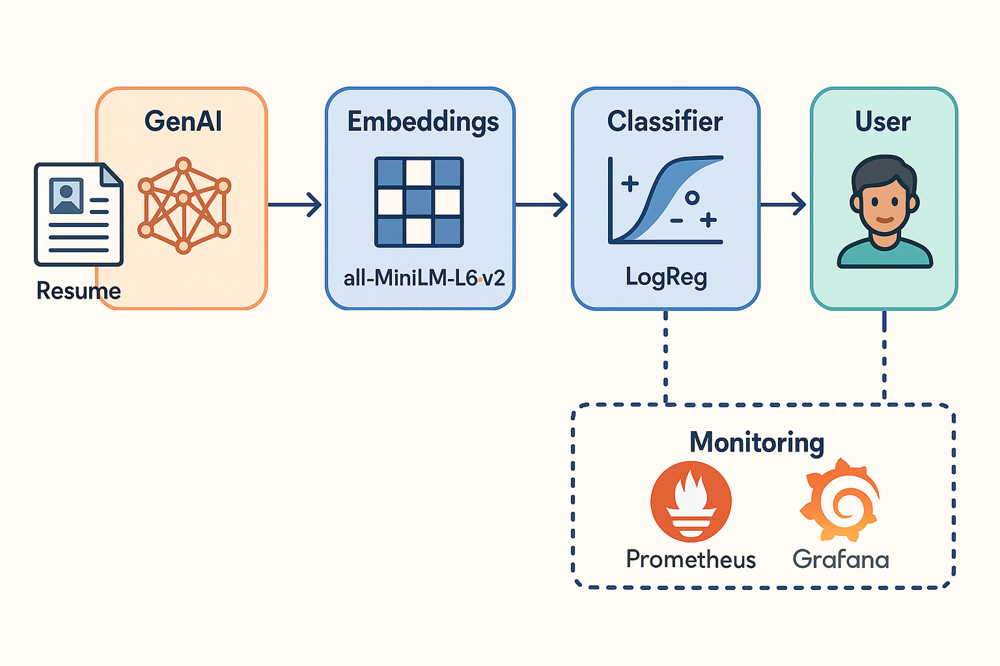
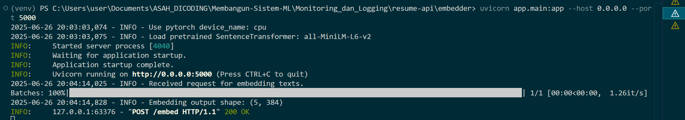
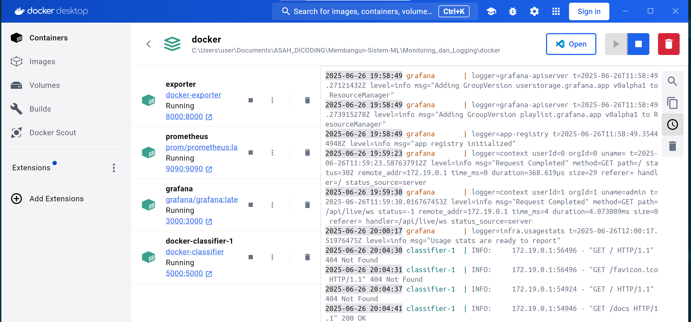

# Resume Screening Classifier for Data Scientist Applications



> ⚠️ *This is a use case example, the final classifier can be integrated with GenAI, this current process does not involve any GenAI components.*

This repository focuses on developing a **scalable and reliable resume classification system** tailored to evaluate the relevance of resumes for data scientist roles. The core implementation emphasizes **machine learning models**, **semantic embeddings**, **API deployment**, and **monitoring infrastructure**, with a strong emphasis on **modular design and long-term maintainability**—not on resume extraction or GenAI parsing.

## Data Flow: GenAI → Embeddings → Classifier → User

1. **Input**: A resume (PDF, DOC, or image) is processed using **GenAI summarization or parsing** to extract core sections: `career_objective`, `skills`, `positions`, etc.
2. **Embedding**: The extracted text is passed to a **SentenceTransformer-based embedding API** (`embedder/`) to generate vector representations.
3. **Classification**: These vectors are sent to a **machine learning classifier** (e.g., logistic regression) to determine relevance.
4. **Output**: Results are served back to the user via FastAPI (`resume-api/classifier/`).

## Problems

* **Manual Screening Is Slow:** Reviewing resumes manually is time-intensive, especially with large applicant pools.
* **Inconsistent & Biased Evaluation:** Human judgment is subjective, leading to unfair and inconsistent results.
* **Keyword Matching Misses Context:** Traditional filters fail to capture the actual meaning behind skills and experiences.
* **Too Many Irrelevant Applications:** Most applicants don’t meet data science criteria, wasting valuable screening effort.

## 🗂️ Project Structure: Machine Learning Development & Monitoring-Logging System

```
├── 📄 Experiment_SML.txt           # Link to GitHub repo for data preprocessing  
├── 📄 Workflow-CI.txt              # Link to GitHub repo for data CI/CD workflow  

├── 📁 Membangun_model/             # Model development, training, tuning, and experiment tracking  
│   ├── 📁 Artifacts/                   # Output artifacts from MLflow runs  
│   ├── 📁 cache/                       # Cached embeddings data during experiments  
│   ├── 📁 cleaned-data/                # Cleaned dataset for training  
│   ├── 📁 screenshots/                 # Visual evidence of saved artifacts and dashboards  
│   ├── 📁 utils/                       # Helper modules for embedding and MLflow environment tracking  
│   │   ├── 📄 PipelineWrapperModel.py     # Wrapper for scikit-learn pipeline with SentenceTransformer for MLflow compatibility  
│   │   ├── 📄 SentenceTransformers.py     # Embedding utility using SentenceTransformer with batching logic  
│   │   └── 📄 env.yaml                    # Custom conda environment to ensure correct dependencies during model logging  
│   ├── 📄 DagsHub.txt                  # Link to the DagsHub project page  
│   ├── 📄 modelling.py                 # ML model training script with MLflow autologging  
│   ├── 📄 modelling_tuning.py          # Hyperparameter tuning with manual MLflow logging  
│   └── 📄 requirements.txt             # Python dependencies for modeling  

├── 📁 Monitoring_dan_Logging/       # Monitoring, logging, alerting, and model API serving  
│   ├── 📁 config/  
│   │   └── 📄 prometheus.yaml              # Prometheus configuration file  
│   ├── 📁 docker/  
│   │   ├── 📄 docker-compose-model.yaml       # Docker Compose file for model services  
│   │   └── 📄 docker-compose-monitoring.yaml  # Docker Compose file for Prometheus & Grafana stack  
│   ├── 📁 evidence/  
│   │   ├── 📁 alerting-grafana/            # Screenshots of Grafana alert configuration and results  
│   │   ├── 📁 model-serving/               # Proof of successful model serving  
│   │   ├── 📁 monitoring-grafana/          # Grafana dashboard visualizations  
│   │   └── 📁 monitoring-prometheus/       # Prometheus metric interface screenshots  
│   ├── 📁 exporter/  
│   │   ├── 📄 Dockerfile                   # Dockerfile for Prometheus metrics exporter  
│   │   ├── 📄 requirements.txt             # Python dependencies for exporter service  
│   │   └── 📄 exporter.py                  # Flask app exposing metrics to Prometheus  
│   ├── 📁 inference/  
│   │   ├── 📄 inference.py                 # Script to send requests to the model API  
│   │   └── 📄 serving_input_example.json   # Sample input for model inference  
│   ├── 📁 model/  
│   │   └── 📄 logreg_model.py              # Logistic Regression model script for API usage  
│   └── 📁 resume-api/  
│       ├── 📁 classifier/                  # ML classifier API served via Docker (e.g., FastAPI or Flask)  
│       │   ├── 📁 app/  
│       │   │   ├── 📄 main.py                  # Main application logic (predict endpoint)  
│       │   │   ├── 📄 model.joblib             # Serialized ML model  
│       │   │   └── 📄 schema.py                # Pydantic schema for input validation  
│       │   ├── 📄 .dockerignore               # Docker ignore rules  
│       │   ├── 📄 Dockerfile                  # Dockerfile to containerize the classifier app  
│       │   └── 📄 requirements.txt            # Dependencies for the classifier service  
│       └── 📁 embedder/                   # Text embedding API running locally (not containerized)  
│           ├── 📁 app/  
│           │   ├── 📄 main.py                  # Main logic for embedding endpoint  
│           │   └── 📄 schema.py                # Input schema for embedding requests  
│           └── 📄 requirements.txt            # Dependencies for the embedding service  
```

## Modular Architecture for Separation of Concerns

The project is structured into **clearly separated modules**, each responsible for a distinct function:

1. **Model Development** (`Membangun_model/`)
2. **Monitoring and Logging System** (`Monitoring_dan_Logging/`)
3. **CI/CD Pipeline** (`Workflow-CI.txt`)
4. **Data Preprocessing Experiment** (`Experiment_SML.txt`)

## Semantic Understanding via Sentence Embeddings

A key innovation in this system is the use of **pre-trained Sentence Transformers** to capture **semantic meaning** from resumes, instead of relying on keyword matching or traditional bag-of-words techniques.

This approach allows the classifier to understand the *context* and *intent* behind phrases such as:

* `"Built machine learning pipelines"` → semantically similar to → `"Designed end-to-end ML workflows"`

By embedding each resume into high-dimensional vector space using models like `all-MiniLM-L6-v2`, the system can generalize across varying terminology while retaining nuanced meaning — crucial for real-world resume screening.

## Embedding API as a Standalone Service



To keep the main Docker image lightweight and scalable, the Sentence Transformers embedding service is run **outside the container** (locally). 

> ⚠️ Running this inside Docker would require downloading large dependencies such as PyTorch, Transformers, and pretrained model weights (~500MB+), which would significantly increase image size, slow down container startup, and create bottlenecks in autoscaled environments.

This design enables:
* **Loose Coupling** – Embeddings can be reused across multiple downstream tasks (e.g., classification, retrieval, similarity search).
* **Flexibility** – Embedding models can be swapped or upgraded independently without changing the classifier or main pipeline logic.

## Embedding Caching for Performance Optimization

The `cache/` directory stores previously computed embeddings, which improves system **efficiency** and **latency** during repeated training.

* Avoids redundant computation.
* Ensures deterministic results during development.
* Accelerates batch inference for large-scale datasets.

## Monitoring & Logging: Best Practices for Model Health

.png)

The `Monitoring_dan_Logging/` module implements a **full observability stack** using:

* **Prometheus**: For collecting metrics (e.g., request rate, latency, error counts).
* **Grafana**: For real-time dashboards and visual monitoring.
* **Custom Exporter**: A lightweight Flask app (`prometheus_exporter.py`) that exposes model-specific metrics (e.g., prediction confidence, total requests).

## Docker-Based Deployment



The project structure is intentionally modular, with each major component placed in a separate folder or container to ensure single-responsibility and ease of debugging. By isolating services, you can debug, restart, or redeploy only the component you’re working on, without affecting the rest of the system.

Using Docker and Docker Compose, the architecture cleanly separates concerns:

* **`classifier/`**: Contains the model logic and FastAPI server to serve classification predictions. This is the core inference service.

**Monitoring Stack:**

* **`prometheus.yaml`**: Configuration for scraping metrics from services.
* **`grafana/`**: Dashboards and visualization setup.
* **`exporter/`**: Custom Prometheus exporter (e.g., for exposing internal metrics from the classifier).

### CI/CD Automation

The **CI/CD workflow** (`Workflow-CI.txt`) ensures that:

* Preprocessing scripts are automatically run on new commits.
* Cleaned and labeled data are updated in version control.
* All training artifacts are stored and tracked via MLflow (`Artifacts/`).
* Model versions can be deployed or served using DagsHub.

### Summary of Design Benefits

| Design Decision                       | Justification                                                        |
| ------------------------------------- | -------------------------------------------------------------------- |
| Sentence Embedding with Transformers  | Enables semantic understanding of resumes, improves generalization   |
| Modular Folder Structure              | Clear separation for model, API, monitoring, CI pipeline                   |
| Embedding API Separation              | Promotes reusability and independence of vector generation           |
| Caching Layer for Embeddings          | Boosts performance, reduces computation and API load                 |
| Prometheus + Grafana Monitoring Stack | Ensures system observability and alerts for production readiness     |
| Dockerized Microservices              | Facilitates reliable and reproducible deployment across environments |
| CI Integration                     | Guarantees data freshness, code quality, and fast iteration cycle    |

## Note & Recommended Learning Resources

To fully understand and extend this project, you should be familiar with the following tools and concepts:

### Tech Stack Used

- **Python** — Core scripting language for machine learning, APIs, and utilities.
- **[Scikit-learn](https://scikit-learn.org/)** — For building and evaluating the logistic regression model.
- **[Sentence-Transformers](https://www.sbert.net/)** — Pretrained semantic vectorizer (`all-MiniLM-L6-v2`) used to embed resume texts.
- **[FastAPI](https://fastapi.tiangolo.com/)** — Lightweight web framework for building the model inference API.
- **[Docker](https://www.docker.com/)** & **[Docker Compose](https://docs.docker.com/compose/)** — For containerizing services and orchestrating them.
- **[MLflow](https://mlflow.org/docs/latest/index.html)** — For experiment tracking, model registry, and artifact management.
- **[Prometheus](https://prometheus.io/)** & **[Grafana](https://grafana.com/)** — For system observability, metric collection, and real-time dashboards.
- **[GitHub Actions](https://docs.github.com/en/actions)** — CI/CD automation to run data preprocessing, testing, and model tracking pipelines.
- **[DagsHub](https://dagshub.com/)** — Optional platform for versioning data and managing ML pipelines remotely.

### Key Learning Materials

- [MLflow Documentation](https://mlflow.org/docs/latest/index.html)
- [FastAPI Docs](https://fastapi.tiangolo.com/)
- [Docker for Data Science](https://towardsdatascience.com/docker-for-data-science-5736a4caa2c2)
- [Monitoring ML with Prometheus and Grafana](https://www.valohai.com/blog/ml-monitoring-with-prometheus-and-grafana/)
- [Understanding Sentence Transformers](https://www.sbert.net/examples/applications/semantic-search/README.html)

> 📝 **Note**: This project does **not** cover OCR, resume parsing, or GenAI summarization modules.